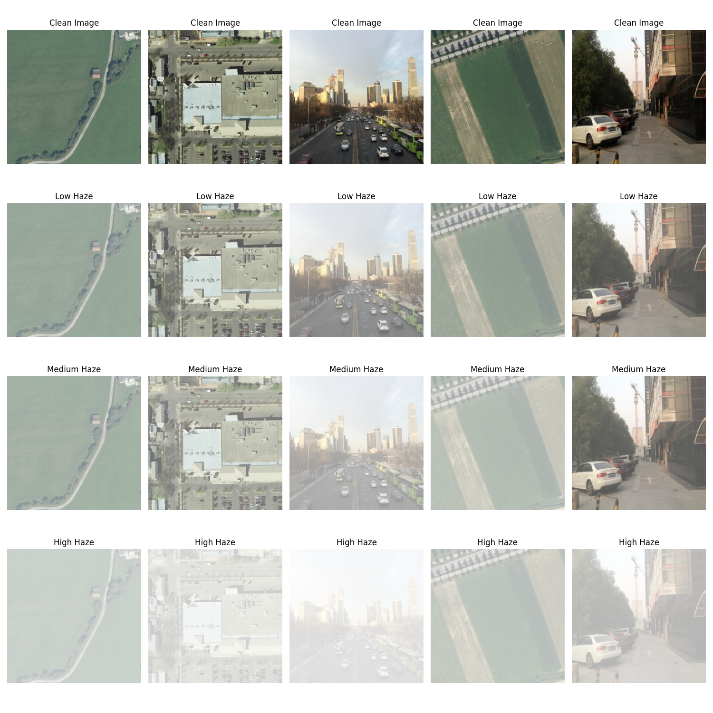
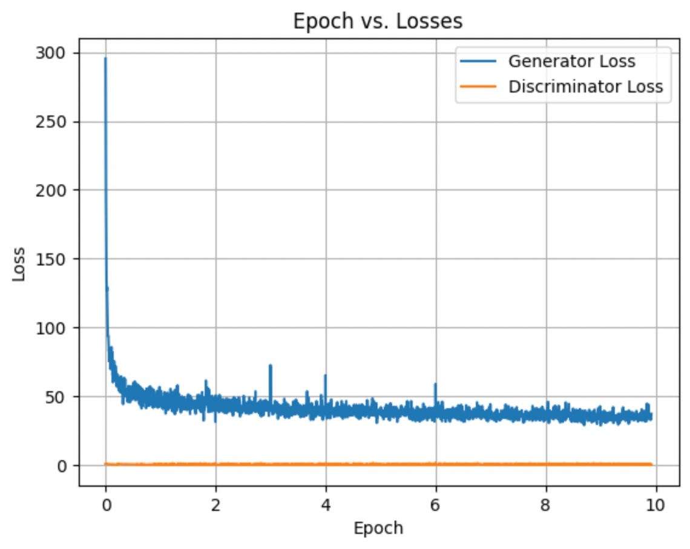

# Dehazing of Images using Generative Adversarial Networks.
Our approach involves employing conditional GANs, where both the generator and discriminator are conditioned
on the hazy input image. A wide range of generators have been tested with different singular and composite loss functions such as Min-Max loss, L1loss, Wasserstein loss, L2loss and reconstruction loss.
We have augmented the initial training dataset by adding new pairs of hazy image & clean image by adding haze to clean images in 2 different levels of intensity.

# Project description
The following points represent major experimental points in our project
1. Augmented new hazy images to introduce new hazy image & clean image pairs in the training set by adding two different levels of haze to clean images to make 2 new pairs from each clean image.
3. Used a Patch-GAN discriminator from [1] for all experiments.
4. Used 6 different generators to obtain the best-performing architecture. The first generator architecture being from [1].
5. Used a composite loss function including L1loss, L2loss, Min-max loss and reconstruction loss. This is from research in [2]
6. Experimented with individual loss functions such as wasserstein loss, l1loss, min-max loss.
7. Collected and analysed results such as a loss graph, generated images to make a comprehensive report.

# Results of Augmentation & Dehazing
The below image shows the varying haze applied to clean images to augment new images, we chose just the medium and low haze images to restrict the size of the dataset.


Convergence can be difficult to achieve using just min-max loss in GANs. The following graph depicts the smooth convergence resulting from using the composite loss function with l1loss, l2loss, min-max loss and reconstruction loss.



# Running the code
The ```submission files``` folder contains code for testing and training the model-1 architecture.
There exists a pretrained model weights file in the folder for testing, hence avoiding a heavy training process.
Kindly follow the below instructions for the same (also present in the ```eadme.md``` inside ```submission files``` folder.

## Installing Required Libraries
1. Change directory to our project directory
```cd CSF425-DEEP-LEARNING-PROJECT-TASK-2```

2. Install requirements.txt
```pip install -r requirements.txt```

## Instructions for Executing Testing
1. Testing code is present in the file ```testing_code_template-task2.py```.

2. As told, you only need to change TEST_DATASET_HAZY_PATH to path of folder with hazy images and TEST_DATASET_OUTPUT_PATH to path of folder you want to save generated images to.

3. [Optional] By default, we use model-1 for testing and we have commented out the model giving the best performance according to our experiments (model - 5), because it's architecture is more complex. If you wish to test the second model, you can uncomment the lines ```model = GeneratorModel5()```, ```weightsPath = "generator_resnet.pth"``` and comment the lines ```model = GeneratorModel1()```, ```weightsPath = "generator_cgan.pth"```. 

4. Run the file.
```python testing_code_template-task2.py```


## Instructions for Executing Training

1. We conduct data-augmentation by creating a low-haze and medium-haze image from each clean image. The code for this is integrated into the training file. Once your dataset folder has 22,857 images after running augmentation, it won't augment on further runs

2. Set the variable ```root_dir``` in the train.py file to the directory where the train and val folders are present

3. [Optional] By default, we use model-1 for training and we have commented out the model giving the best performance according to our experiments (model - 5), because it's architecture is more complex. If you wish to test the second model, you can uncomment the line ```model = GeneratorModel5()``` and comment the line ```model = GeneratorModel1()```.

4. [Optional] You can modify the number of epochs as the ```num_epochs``` variable passed to the trainer class at the bottom of the train.py file. Moreover, you can also set ```use_l1_loss``` to false if you wish to omit it.
   
5. Run the train.py file.
```python train.py```

6. The code will show you that it is augmenting image files upto image number 7619. Afterwards, it automatically starts training.


## Credits
These references along with others are available in our project report: ```Project Report\CSF425_Deep_Learning_Project___Task_2_Report_compressed.pdf```.
[1] The model-1 generator architecture and Patch-GAN discriminator are from: https://github.com/AquibPy/Pix2Pix-Conditional-GANs
[2] The composite loss function is from [Runde Li, Jinshan Pan, Zechao Li, and Jinhui Tang. Single image dehazing via conditional generative adversarial
network. In Proceedings of the IEEE conference on computer vision and pattern recognition, pages 8202–8211,
2018.](https://openaccess.thecvf.com/content_cvpr_2018/html/Li_Single_Image_Dehazing_CVPR_2018_paper.html)
[3] The function for adding haze to augment images is from: https://www.freecodecamp.org/news/image-augmentation-make-it-rain-make-it-snow-how-to-modify-a-photo-with-machine-learning-163c0cb3843f/
[4] The training process for Wassersteing GANs is from: https://arxiv.org/abs/1701.07875
